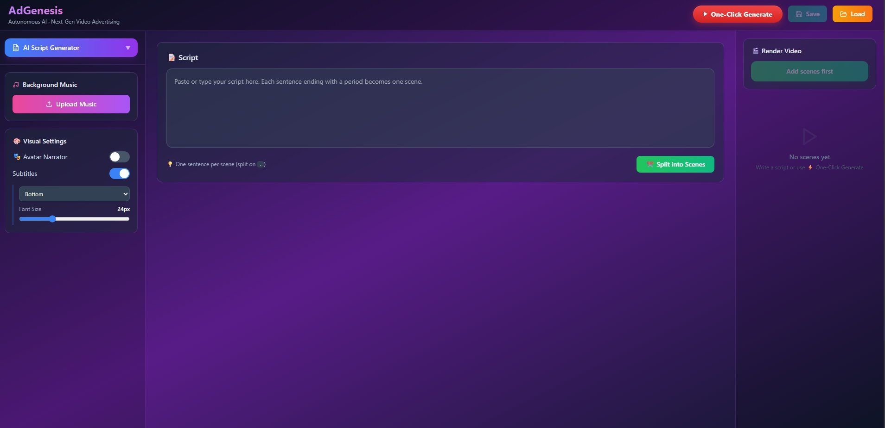

# AdGenesis 🎬
### Autonomous AI · Next-Gen Video Advertising

An end-to-end AI video generation platform that turns a topic or script into a fully produced video — with stock footage, AI voiceover, subtitles, and an optional lip-synced avatar narrator.



---

## ✨ Features

- **One-Click Pipeline** — topic → script → scenes → footage → render, fully automated
- **AI Script Generator** — Groq (LLaMA 3.3 70B) writes scene-by-scene video scripts
- **Dynamic Mode** — context-aware Pexels stock video fetched per scene in parallel
- **Static Mode** — AI image generation via Cloudflare Workers AI (Flux-1-schnell)
- **ElevenLabs TTS** — high-quality voiceover (Will / Jessica) with gTTS fallback
- **Avatar Narrator** — lip-synced talking head via Wav2Lip (male / female)
- **Subtitles** — ASS subtitles auto-generated and burned into video
- **Background Music** — upload and mix custom music tracks
- **GPU Accelerated** — NVENC encoding, CUDA inference (RTX supported)

---

## 🖥️ Tech Stack

| Layer | Technology |
|-------|-----------|
| Backend | Python 3.11, Flask |
| Frontend | React + Vite + Tailwind CSS |
| LLM | Groq API — llama-3.3-70b-versatile |
| TTS | ElevenLabs API + gTTS fallback |
| Image Gen | Cloudflare Workers AI — Flux-1-schnell |
| Stock Media | Pexels API |
| Avatar | Wav2Lip |
| Video | ffmpeg + MoviePy |
| GPU | PyTorch CUDA 11.8, hevc_nvenc |

---

## ⚙️ Prerequisites

- **Python 3.11.13** (via Conda recommended)
- **Node.js 18+**
- **ffmpeg** — install via `pip install ffmpeg-downloader` or add to PATH manually
- **Conda** — [Miniconda](https://docs.conda.io/en/latest/miniconda.html)
- **GPU** with CUDA 11.8 support (optional — avatar rendering only)

---

## 🚀 Installation

### 1. Clone the repo

```bash
git clone https://github.com/aniruddha200520/adgenesis.git
cd adgenesis
```

### 2. Set up the Python environment

```bash
conda create -n myenv1 python=3.11
conda activate myenv1
pip install -r requirements.txt
```

**GPU support (CUDA 11.8) — run this after the above:**
```bash
pip install torch==2.7.1+cu118 torchvision==0.22.1+cu118 --index-url https://download.pytorch.org/whl/cu118
```

### 3. Set up the frontend

```bash
cd frontend
npm install
```

### 4. Configure environment variables

Create a file at `backend/.env`:

```env
# Groq
GROQ_API_KEY=your_groq_api_key

# ElevenLabs — add up to 5 keys for automatic rotation
ELEVENLABS_API_KEY_1=your_key_1
ELEVENLABS_API_KEY_2=your_key_2
ELEVENLABS_API_KEY_3=your_key_3

# Cloudflare Workers AI (static image generation)
CLOUDFLARE_ACCOUNT_ID=your_account_id
CLOUDFLARE_API_TOKEN=your_api_token

# Pexels (stock footage)
PEXELS_API_KEY=your_pexels_key
```

### 5. Set up Wav2Lip (avatar feature only)

The avatar feature requires [Wav2Lip](https://github.com/Rudrabha/Wav2Lip) set up separately.

```bash
# 1. Clone Wav2Lip somewhere on your machine
git clone https://github.com/Rudrabha/Wav2Lip.git C:/Projects/Wav2Lip

# 2. Create a separate conda env for Wav2Lip
conda create -n wav2lip python=3.8
conda activate wav2lip
cd C:/Projects/Wav2Lip
pip install -r requirements.txt

# 3. Download the pretrained model weights
#    → https://github.com/Rudrabha/Wav2Lip#getting-the-weights
#    Place the file at: C:/Projects/Wav2Lip/checkpoints/wav2lip_gan.pth

# 4. Copy the runner script from this repo into Wav2Lip
copy backend\wav2lip_runner.py C:\Projects\Wav2Lip\
```

Then update `WAV2LIP_DIR` in `backend/utils.py` to match your Wav2Lip location:

```python
WAV2LIP_DIR = r"C:\Projects\Wav2Lip"   # ← update this
```

> If you skip Wav2Lip, everything works — the avatar is simply not rendered.

---

## ▶️ Running the App

**Terminal 1 — Backend:**
```bash
conda activate myenv1
cd backend
python app.py
# → http://localhost:5001
```

**Terminal 2 — Frontend:**
```bash
cd frontend
npm run dev
# → http://localhost:5173
```

Open **http://localhost:5173** in your browser.

---

## 📁 Project Structure

```
adgenesis/
├── backend/
│   ├── app.py                  # Flask API — all routes
│   ├── utils.py                # Core render pipeline
│   ├── pexels_api.py           # Pexels stock media integration
│   ├── wav2lip_runner.py       # Wav2Lip wrapper (copy to Wav2Lip folder)
│   ├── assets/
│   │   └── avatars/            # Presenter photos (male / female)
│   ├── uploads/                # Uploaded & downloaded media (git-ignored)
│   ├── outputs/                # Rendered videos (git-ignored)
│   ├── temp/                   # Temp processing files (git-ignored)
│   └── generated_images/       # AI-generated scene images (git-ignored)
├── frontend/
│   └── src/
│       └── components/
│           └── VideoForm.jsx   # Main UI component
├── requirements.txt
└── README.md
```

---

## 🔑 API Keys — Where to Get Them

| Service | Sign Up | Free Tier |
|---------|---------|-----------|
| **Groq** | https://console.groq.com | ✅ Generous free tier |
| **ElevenLabs** | https://elevenlabs.io | ✅ 10K chars/month |
| **Cloudflare Workers AI** | https://dash.cloudflare.com | ✅ 10K requests/day |
| **Pexels** | https://www.pexels.com/api | ✅ Free |

---

## 📝 Notes

- **Multiple ElevenLabs keys** — add up to 5 keys in `.env` (`ELEVENLABS_API_KEY_1` through `_5`). The backend rotates automatically when quota runs out.
- **ElevenLabs key setup** — when creating a key, turn **off** "Restrict key" to allow access to all voices and endpoints.
- **Avatar without GPU** — Wav2Lip will fall back to CPU inference, but it will be very slow (~5–10 min per render).
- **Temp file cleanup** — temp files are automatically deleted after each render.
- **ffmpeg location** — if ffmpeg is not on PATH, set `FFMPEG_PATH` in `backend/utils.py` to the full executable path.
